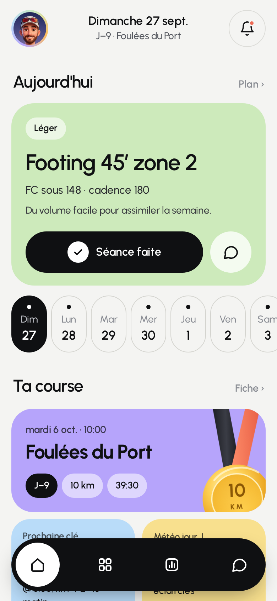
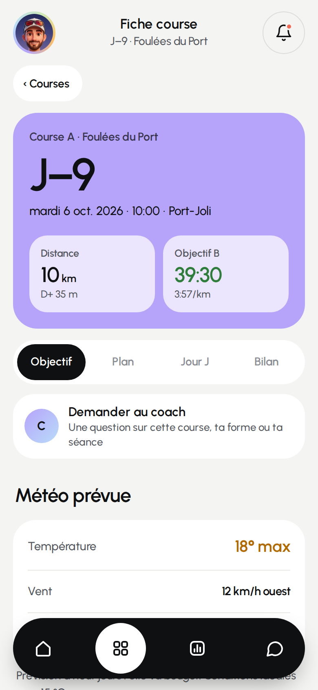
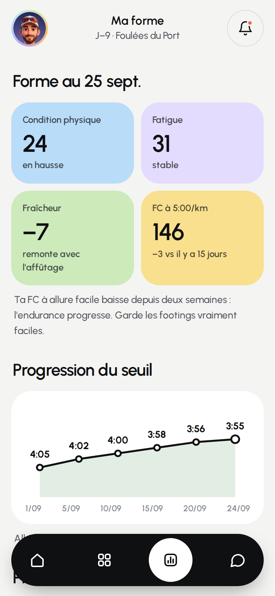
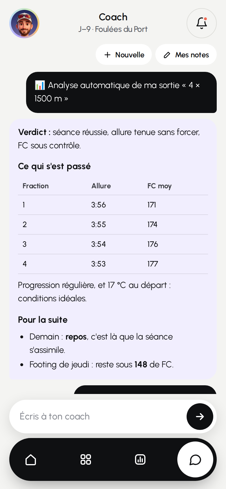
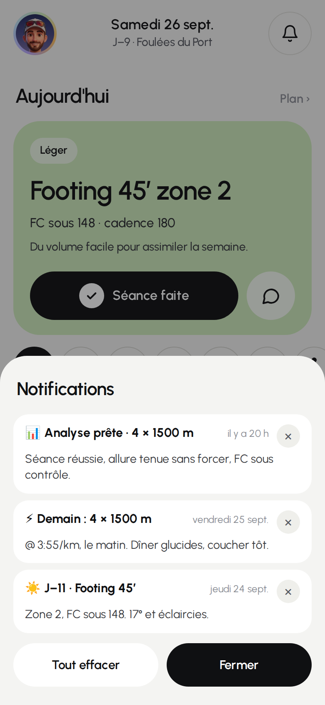

<div align="center">


# Kida

**Ton coach de course à pied, dans ta poche.**
Tes courses, ton plan, ta forme et un coach IA qui connaît tout ton historique Strava.

[](https://github.com/Thekida35/Kida_Coaching/actions/workflows/tests.yml)


</div>

<table>
  <tr>
    <td align="center"><br><sub><b>Aujourd'hui</b></sub></td>
    <td align="center"><br><sub><b>Fiche course</b></sub></td>
    <td align="center"><br><sub><b>Ma forme</b></sub></td>
    <td align="center"><br><sub><b>Coach</b></sub></td>
    <td align="center"><br><sub><b>Notifications</b></sub></td>
  </tr>
</table>

<sub>Captures réalisées avec des données fictives (`npm run screenshots`).</sub>

---

## ✨ Fonctionnalités

### 🏠 Aujourd'hui
La séance du jour en grand (allures, FC, le « pourquoi »), la semaine à venir d'un coup d'œil, le compte à rebours jusqu'à la prochaine course et la météo. Un bouton **Séance faite** pour cocher, un autre pour en parler au coach.

### 🏁 Mes courses
Toutes les courses à venir et passées, avec pour chacune une **fiche complète** :
- 🎯 **Objectif** : objectifs A / B / C, prédiction, allure cible, stratégie kilomètre par kilomètre.
- 🗓 **Plan** : les séances jusqu'au jour J, avec la météo de chaque jour.
- ⏰ **Jour J** : le déroulé heure par heure, la veille, le sac à préparer (à cocher).
- 🏅 **Bilan** : le résultat, le classement et ton ressenti, récupérés depuis Strava.

### 📈 Ma forme
Condition, fatigue, fraîcheur, FC à allure facile, progression de l'allure seuil en graphique, prédictions de temps, records et les 7 derniers jours d'entraînement.

### 🤖 Coach IA
Une vraie conversation, gardée d'une ouverture à l'autre. Le coach connaît :
- ton profil (blessures, habitudes, chaussures, physiologie), modifiable dans **Mes notes** ;
- ta course en ligne de mire et son plan ;
- **12 mois d'historique Strava** : volume par semaine, séances clés, détail des dernières semaines.

Les réponses arrivent au fil de l'eau, mises en forme (titres, tableaux, listes).

📎 **Donne-lui tes fichiers** avec le trombone : photos ou captures, PDF (bilan de kiné, plan, règlement), séances de montre (`.fit`, `.gpx`, `.tcx`), tableurs (`.xlsx`, `.csv`) ou textes. Il les lit une fois et **s'en souvient pour toujours** ; la liste se gère dans **Mes notes**.

### 📊 Analyse automatique de tes sorties
Dès qu'une course à pied arrive sur Strava, le coach l'analyse **sans que tu demandes rien** : verdict, tours et kilomètres, FC, météo au départ, comparaison avec la séance prévue, consignes pour la suite. L'analyse t'attend dans le chat et une notification te prévient.

### 🔔 Notifications
- ☀️ **Brief du matin** à l'heure que tu choisis, dans les jours avant une course.
- ⚡ **Veille de séance clé**, le soir d'avant.
- 🏅 **Bilan de course**, le soir de la course.
- 📊 **Analyse prête** après chaque sortie.

Toutes rangées dans la **cloche** (point rouge seulement quand il y a du nouveau, suppression une par une ou d'un coup), et réglables une par une depuis ton avatar.

### 🔒 Et aussi
- 📲 **S'installe sur l'iPhone** comme une vraie app (écran d'accueil, plein écran, ouverture instantanée).
- 🔑 Accès protégé par un **code à 4-6 chiffres**, modifiable dans l'app.
- 🌦 Météo gratuite et sans clé (Open-Meteo).
- 🧮 Calculateur VDOT et allures d'entraînement.

---

## 🚀 Déployer ta propre copie

Compte environ 20 minutes. Tout est gratuit (offres de base de Vercel, Neon, Google AI Studio et Strava).

### 1. Récupérer le code
Fais un **fork** de ce dépôt sur ton compte GitHub.

> 💡 Au premier lancement, l'app se remplit avec les courses de `src/data/hub-seed.json`, et le profil du coach vient de `DEFAULT_NOTES` dans `src/lib/hub/coachContext.ts`. Remplace-les par les tiens (le profil se modifie aussi ensuite dans l'app, bouton **Mes notes**).

### 2. La base de données : Neon
1. Crée un compte sur [neon.tech](https://neon.tech) puis un projet.
2. Copie l'adresse de connexion (`postgresql://…`) : c'est ton `DATABASE_URL`.

Les tables se créent toutes seules à la première mise en ligne.

### 3. Le coach : clé Gemini
Sur [aistudio.google.com/apikey](https://aistudio.google.com/apikey), crée une clé : c'est ton `GEMINI_API_KEY`.

> 💡 **Facultatif — un coach plus fin avec Claude.** Ajoute une clé API Anthropic ([console.anthropic.com](https://console.anthropic.com), crédits prépayés, facturés à part d'un abonnement claude.ai) dans `ANTHROPIC_API_KEY` : le coach passe automatiquement sur Claude (`CLAUDE_MODEL`, `claude-opus-5` par défaut). Gemini continue de lire les photos et PDF.

### 4. Les notifications : clés VAPID
Sur ton ordinateur :
```bash
npx web-push generate-vapid-keys
```
Tu obtiens une clé publique (`VAPID_PUBLIC_KEY`) et une clé privée (`VAPID_PRIVATE_KEY`).

### 5. Mettre en ligne : Vercel
1. Sur [vercel.com](https://vercel.com), **Add New → Project** et importe ton fork.
2. Avant de cliquer sur **Deploy**, ajoute les variables d'environnement :

| Variable | Valeur |
|---|---|
| `DATABASE_URL` | l'adresse Neon (étape 2) |
| `APP_CODE` | ton code d'accès, 4 à 6 chiffres |
| `AUTH_SECRET` | une longue phrase aléatoire (signe les connexions) |
| `CRON_SECRET` | une autre phrase aléatoire (protège les notifications planifiées) |
| `APP_URL` | l'adresse de ton app, ex. `https://mon-kida.vercel.app` |
| `GEMINI_API_KEY` | la clé Gemini (étape 3) |
| `ANTHROPIC_API_KEY` | *facultatif*, pour que le coach utilise Claude |
| `VAPID_PUBLIC_KEY` / `VAPID_PRIVATE_KEY` | les clés de l'étape 4 |
| `STRAVA_CLIENT_ID` / `STRAVA_CLIENT_SECRET` | à l'étape 6 (tu peux les ajouter après) |
| `GEMINI_MODEL` | *facultatif*, `gemini-2.5-flash` par défaut |

3. Clique sur **Deploy**. Ton app est en ligne 🎉

### 6. Brancher Strava
1. Sur [strava.com/settings/api](https://www.strava.com/settings/api), crée une application.
2. **Authorization Callback Domain** : le domaine de ton app, sans `https://` (ex. `mon-kida.vercel.app`).
3. Copie le **Client ID** et le **Client Secret** dans Vercel (`STRAVA_CLIENT_ID`, `STRAVA_CLIENT_SECRET`), puis **Redeploy**.
4. Dans l'app : touche ton avatar → **Strava → Connecter**.

### 7. Les notifications à l'heure
L'offre gratuite de Vercel ne lance le planificateur qu'une fois par jour. Un workflow GitHub (`.github/workflows/notify.yml`) prend le relais **toutes les 30 minutes** :
1. Dans ton fork : **Settings → Secrets and variables → Actions**.
2. Onglet **Secrets** : ajoute `CRON_SECRET` (la même valeur que sur Vercel).
3. Onglet **Variables** : ajoute `APP_URL` (l'adresse de ton app).

### 8. Sur ton iPhone
Ouvre ton app dans Safari → **Partager → Sur l'écran d'accueil**. Ouvre-la depuis l'écran d'accueil, puis avatar → **Notifications → Activer**.

---

## 🛠 Développement

```bash
npm install
npm run dev          # l'app en local
npm test             # tests du serveur (vitest)
npm run test:e2e     # tests de l'interface (Playwright, API simulée)
npm run screenshots  # regénère les captures du README
```

Architecture, conventions et essais en local : voir [`CLAUDE.md`](CLAUDE.md).
